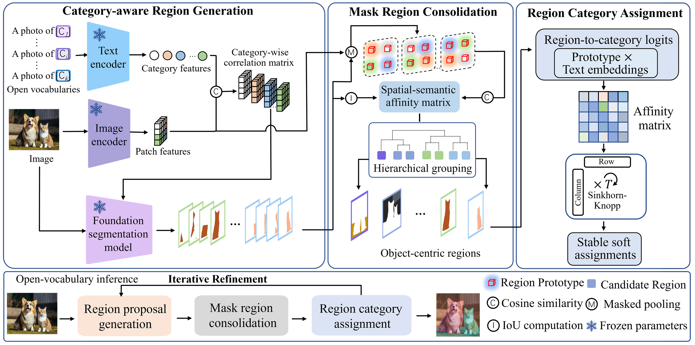

<div align="center">

# RTTS

### Towards Robust Test-Time Segmentation via Iterative Object-centric Adaptation

**Junhui Yin\* · Wenzhe Wang\* · Bin Fan · Hongmin Liu**  
University of Science and Technology Beijing  
<sup>\* Equal contribution</sup>

[](#installation)
[](#installation)
[](LICENSE)

[Overview](#overview) · [Installation](#installation) · [Datasets](#datasets) · [Evaluation](#evaluation) · [Results](#results) · [Citation](#citation)

</div>

Official PyTorch implementation of **RTTS**.

## Overview

RTTS addresses open-vocabulary semantic segmentation under test-time domain shift through iterative object-centric refinement. It combines the semantic cues of CLIP with the structural priors of SAM to improve spatial coherence and semantic consistency.

<p align="center">
  
</p>

- **Category-aware region generation:** category-specific CLIP responses guide SAM to generate semantically relevant mask proposals.
- **Mask region consolidation:** spatial continuity and semantic consistency group fragmented proposals into coherent object-level regions.
- **Context-aware category assignment:** Sinkhorn–Knopp normalization stabilizes region-to-category assignment while retaining soft uncertainty. Refined semantics guide the next round of region generation.

## Installation

The evaluation stack uses **Python 3.10**, **PyTorch 2.1.2**, **CUDA 11.8**, and **MMSegmentation 1.2.2**. An NVIDIA GPU is required. The commands below use Bash.

```bash
git clone https://github.com/wkris9527/RTTS.git
cd RTTS

conda create -n rtts python=3.10.13 -y
conda activate rtts

python -m pip install torch==2.1.2 torchvision==0.16.2 --index-url https://download.pytorch.org/whl/cu118
python -m pip install mmcv==2.1.0 -f https://download.openmmlab.com/mmcv/dist/cu118/torch2.1/index.html
python -m pip install -r requirements.txt
```

### Model weights

The default evaluation uses **NaCLIP ViT-L/14** and **SAM ViT-H**. CLIP weights download automatically on first use. Download the SAM checkpoint into the repository root:

```bash
curl -L https://dl.fbaipublicfiles.com/segment_anything/sam_vit_h_4b8939.pth -o sam_vit_h_4b8939.pth
```

For **SAM2**, obtain the source code, installation instructions, and model checkpoints from the [official Meta SAM2 repository](https://github.com/facebookresearch/sam2). SAM2 is optional and is not required by the default RTTS evaluation. Its environment requirements differ from the stack above; follow the upstream instructions in a separate environment.

## Datasets

Evaluation uses the **validation splits** of five datasets, covering seven benchmark settings. Follow [MMSegmentation's dataset preparation guide](https://github.com/open-mmlab/mmsegmentation/blob/main/docs/en/user_guides/2_dataset_prepare.md) to prepare images and segmentation labels.

| Dataset | Script directory | Classes | Required paths under the dataset root |
| :--- | :--- | :--- | :--- |
| PASCAL VOC | `bash/v20/`, `bash/v21/` | 20 / 21 | `JPEGImages/`, `SegmentationClass/`, `ImageSets/Segmentation/val.txt` |
| PASCAL Context | `bash/p59/`, `bash/p60/` | 59 / 60 | `JPEGImages/`, `SegmentationClassContext/`, `ImageSets/SegmentationContext/val.txt` |
| Cityscapes | `bash/cityscapes/` | 19 | `leftImg8bit/val/`, `gtFine/val/` |
| COCO-Object | `bash/coco_obj/` | 80 | `images/val2017/`, `annotations/val2017/` |
| COCO-Stuff | `bash/coco_stuff/` | 171 | `images/val2017/`, `annotations/val2017/` |

Cityscapes and COCO require the prepared `*_labelTrainIds.png` labels. The VOC21 and Context60 settings include background; VOC20 and Context59 exclude it. Label definitions and remapping are provided in `utils_local/segmentation_datasets.py`.

The 15 corruption types are generated during evaluation at **severity 5**; no separate corrupted dataset download is required.

## Evaluation

Run all commands from the repository root.

### Clean evaluation

Example for PASCAL VOC20:

```bash
CUDA_VISIBLE_DEVICES=0 python main.py \
  --adapt --method mlmp \
  --dataset PascalVOC20Dataset --data_dir /path/to/VOC2012 \
  --save_dir outputs/v20-clean \
  --ovss_type naclip --ovss_backbone ViT-L/14 \
  --prompt_dir prompts.yaml \
  --vision_outputs -1 -2 -3 -4 -5 -6 -7 -8 -9 -10 -11 -12 -13 -14 -15 -16 -17 -18 \
  --alpha_cls 1.0 --batch-size 1 --workers 4 \
  --init_resize 224 224 --patch_size 224 224 --patch_stride 112 \
  --corruptions_list original \
  --lr 0.001 --steps 10 --trials 1 --seed 0 \
  --class_extensions --plot_loss
```

The CLI uses `--method mlmp`, matching the original `rtts.sh` scripts. Those scripts use ten gradient-adaptation steps alongside two rounds of region refinement in the backbone.

### Corruption robustness and other benchmarks

Original experiment scripts are provided in [bash/](bash/). Set `GPU_ID`, `DATA_DIR`, and `SAVE_DIR` in the selected script before running it:

```bash
# PASCAL VOC20: clean inputs and all 15 corruptions
bash bash/v20/rtts.sh

# Cityscapes: clean inputs and all 15 corruptions
bash bash/cityscapes/rtts.sh
```

Use the corresponding `rtts.sh` under the other dataset directories for VOC21, Context59/60, COCO-Object, and COCO-Stuff. Set `TRIALS=3` to run three trials. The original comparison scripts for MLMP, TENT, TPT, WATT, CLIPArTT, and NoAdapt are also retained.

Standard presets use a 224 × 224 resize. Cityscapes uses the original 1120 × 560 resize with 224 × 224 sliding windows and stride 112. Evaluation follows the label remapping and resolution in the released dataset code.

### Results output

The evaluator writes `results.txt`, configurations, and per-corruption metrics under `SAVE_DIR`. Report clean mIoU separately from the unweighted mean over all 15 corruption types, excluding clean inputs. Use a separate output directory for each experiment.

The original generated `cmd.sh` references `main_segmentation.py`; rerun the command above or the selected script instead.

## Results

**mIoU (%) reported in Table I of the manuscript.** Clean scores evaluate uncorrupted inputs; corruption scores average the 15 corruption types at severity 5.

| Benchmark | Clean | Corruption |
| :--- | ---: | ---: |
| PASCAL VOC21 | 55.54 | 47.93 |
| PASCAL VOC20 | 85.30 | 76.84 |
| PASCAL Context59 | 35.31 | 28.63 |
| PASCAL Context60 | 30.94 | 25.52 |
| Cityscapes | 40.99 | 25.26 |
| COCO-Object | 31.96 | — |
| COCO-Stuff | 23.22 | — |

A dash indicates that the corresponding result is not reported in Table I. Full benchmark inference has not been rerun during repository preparation.

## Citation

If you find this work useful, please cite:

```bibtex
@unpublished{yin2026rtts,
  title  = {Towards Robust Test-Time Segmentation via Iterative Object-centric Adaptation},
  author = {Yin, Junhui and Wang, Wenzhe and Fan, Bin and Liu, Hongmin},
  year   = {2026},
  note   = {Manuscript},
  url    = {https://github.com/wkris9527/RTTS}
}
```

## Acknowledgments and license

This project builds on [MLMP](https://github.com/dosowiechi/MLMP), [NaCLIP](https://github.com/sinahmr/NaCLIP), [CLIP](https://github.com/openai/CLIP), and [SAM](https://github.com/facebookresearch/segment-anything). We thank their authors for making the code and models available.

RTTS contributions are released under the [MIT License](LICENSE). Third-party copyright and license texts are retained in [THIRD_PARTY_NOTICES.md](THIRD_PARTY_NOTICES.md).

For questions and reproducibility reports, please open a [GitHub issue](https://github.com/wkris9527/RTTS/issues).

