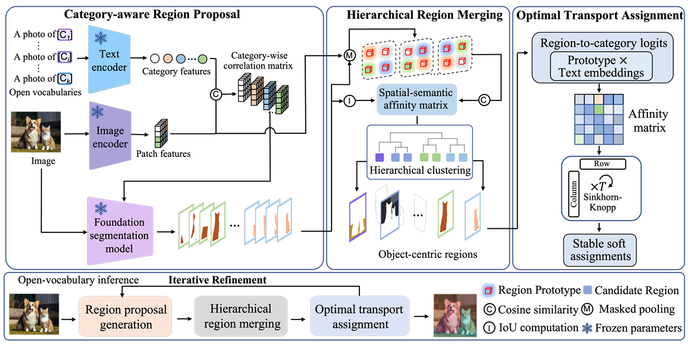

# Towards Robust Test-Time Segmentation via Iterative Object-centric Adaptation

The official implementation of our paper "Towards Robust Test-Time Segmentation via Iterative Object-centric Adaptation".

## Method

<p align="justify">
<b>Abstract:</b> Open-vocabulary semantic segmentation (OVSS) aims to assign pixel-level semantic labels from an open-ended vocabulary, but remains highly vulnerable to domain shifts. While pre-trained vision–language models (VLMs) provide strong zero-shot generalization, their dense predictions often exhibit spatial incoherence and semantic instability at test time. Existing test-time adaptation (TTA) methods largely rely on patch-wise confidence predictions inherited from image-level classification, which may amplify semantic noise in dense prediction settings. We propose a \textbf{R}obust object-centric \textbf{T}est-\textbf{T}ime \textbf{S}egmentation framework (RTTS) that iteratively updates object region proposals and reassigns their semantic labels to improve spatial coherence and semantic consistency. Specifically, CLIP-based semantic cues are used to guide foundation segmentation models for category-aware region proposal generation. A hierarchical object-centric region merging strategy is designed to recover complete object regions by jointly modeling spatial overlap and semantic similarity. To further stabilize semantic assignment under noisy test-time predictions, RTTS employs an optimal transport assignment strategy that leverages global image-level context to produce smooth region-to-category assignments while preserving informative uncertainty. Extensive experiments on benchmark datasets demonstrate that RTTS achieves state-of-the-art performance under challenging domain-shift scenarios, validating its robustness and effectiveness.
</p>

<p align="center">
    
</p>

<!-- Add space -->
<div style="margin-bottom: 15px;"></div>

* We propose a fully training-free, object-centric test-time adaptation framework for open-vocabulary semantic segmentation that improves robustness under domain shift.

* We design a hierarchical object-centric merging strategy that integrates VLM predictions with foundation segmentation models to recover coherent object regions.

* We develop an optimal transport assignment strategy to stabilize region-level semantic predictions under noisy test-time adaptation.


## Requirements 
- [Python 3.10.13](https://www.python.org/)
- [CUDA 11.8](https://developer.nvidia.com/cuda-zone)
- [PyTorch 2.1.2](https://pytorch.org/)
- [MMSegmentation 1.2.2](https://github.com/open-mmlab/mmsegmentation)


## Getting Started
### Step 1: Requirements
To run RTTS, please install the following packages, and conda environment:

```bash
conda create -n RTTS python==3.10.13
conda activate RTTS
pip install torch==2.1.2 torchvision==0.16.2 torchaudio==2.1.2 --index-url https://download.pytorch.org/whl/cu118
pip install -r requirements.txt
```

---
### Step 2: Prepare Datasets

We evaluate RTTS on seven widely-used segmentation benchmarks, chosen to span indoor/outdoor scenes, object–stuff mixes, and a range of class granularities:

- [PASCAL VOC 20/21](https://paperswithcode.com/dataset/pascal-voc) – The 20 foreground categories (with an optional challenging background label).
- [PASCAL Context 59/60](https://paperswithcode.com/paper/the-role-of-context-for-object-detection-and) – The 59 foreground categories (with an optional challenging background label).
- [CityScapes](https://www.cityscapes-dataset.com/) – 19 urban-scene categories.
- [COCO-Object](https://arxiv.org/abs/1405.0312) – the 80 COCO object classes.
- [COCO-Stuff 164k](https://arxiv.org/abs/1612.03716) – 164 thing-and-stuff classes.


Please follow the [MMSeg data preparation document](https://github.com/open-mmlab/mmsegmentation/blob/main/docs/en/user_guides/2_dataset_prepare.md) to download and pre-process the datasets. Please note that we only use the validation split of each dataset.


Additionally, inspired by [ImageNet-C](https://github.com/hendrycks/robustness), we generate 15 corruption types (e.g., noise, blur, weather, compression) *on-the-fly* at test time, allowing us to effectively evaluate each adaptation method’s robustness to diverse distribution shifts. 

Remember to modify the dataset paths `DATA_DIR` and corruption type in the bash files in `./bash`. 

---
### Step 3: Perform Adaptation

There are different bash files in `./bash` directory which are prepared to reproduce the results of the paper for **different methods**, **datasets**, and **corruptions**.

We support these methods:
- RTTS (our proposed method)
- [MLMP](https://arxiv.org/html/2505.21844)
- [WATT](https://arxiv.org/abs/2406.13875)
- [CLIPArTT](https://arxiv.org/abs/2405.00754)
- [TPT](https://arxiv.org/abs/2209.07511)
- [TENT](https://arxiv.org/abs/2006.10726)

To reproduce our results on PASCAL VOC 20 (v20)— the clean split and all 15 corruption variants—simply run `./bash/v20/rtts.sh`:
```bash
# GPU Configuration
GPU_ID=0

# Dataset Configuration
DATASET=PascalVOC20Dataset
DATA_DIR=".data/VOC2012/"
INIT_RESIZE="224 224"
ALL_CORRUPTIONS="original gaussian_noise shot_noise impulse_noise defocus_blur glass_blur motion_blur zoom_blur snow frost fog brightness contrast elastic_transform pixelate jpeg_compression"
WORKERS=4

# Method and OVSS Model Configuration
METHOD="rtts"
OUT_VISION="-1 -2 -3 -4 -5 -6 -7 -8 -9 -10 -11 -12 -13 -14 -15 -16 -17 -18"
PROMPT_DIR="prompts.yaml"
ALPHA_CLS=1.0
OVSS_TYPE="naclip"
OVSS_BACKBONE="ViT-L/14"

# Hyperparameters
BATCH_SIZE=2
LR=0.001
STEPS=10
TRIALS=3

# Output
SAVE_DIR=".save/${DATASET}/${METHOD}/"

# Run
CUDA_VISIBLE_DEVICES=$GPU_ID python main.py --adapt --method $METHOD --prompt_dir $PROMPT_DIR --vision_outputs $OUT_VISION --alpha_cls $ALPHA_CLS --ovss_type $OVSS_TYPE --ovss_backbone $OVSS_BACKBONE --save_dir $SAVE_DIR --data_dir $DATA_DIR --dataset $DATASET --workers $WORKERS --init_resize $INIT_RESIZE --patch_size 224 224 --patch_stride 112 --corruptions_list $ALL_CORRUPTIONS --lr $LR --steps $STEPS --batch-size $BATCH_SIZE --trials $TRIALS --seed 0 --plot_loss --class_extensions

```

## Results

Comparison with state-of-the-art TTA methods for open-vocabulary segmentation. For a more detailed analysis and a complete table of the results, please refer to our paper.

*Gray rows denote the average performance across various corruption types.*

| Methods  | NoAdapt |  TENT  |  TPT   |  WATT  | CLIPArTT |  MLMP  | **Ours** |
|----------|---------|--------|--------|--------|----------|--------|----------|
| V21-O    | 45.12   | 45.65  | 45.17  | 28.58  | 39.50    | 50.78  | **55.54** ↑4.76 |
| V21-C (Average) | 40.75 | 40.95 | 40.77 | 24.12 | 34.16 | 46.25 | **47.93** ↑1.68 |
| V20-O    | 75.91   | 77.00  | 75.39  | 57.73  | 72.77    | 83.76  | **85.30** ↑1.54 |
| V20-C (Average) | 69.01 | 69.03 | 69.03 | 48.30 | 63.39 | **77.58** | 76.84 ↓0.74 |
| P59-O    | 28.23   | 28.73  | 28.26  | 16.55  | 24.60    | 31.95  | **35.31** ↑3.36 |
| P59-C (Average) | 23.88 | 23.88 | 23.88 | 13.37 | 19.72 | 27.03 | **28.63** ↑1.60 |
| P60-O    | 24.95   | 25.29  | 24.98  | 14.77  | 21.88    | 27.99  | **30.94** ↑2.95 |
| P60-C (Average) | 21.39 | 21.25 | 21.49 | 12.08 | 17.79 | 24.07 | **25.52** ↑1.45 |
| City-O   | 29.49   | 30.95  | 29.57  | 20.77  | –        | 27.89  | **40.99** ↑13.10 |
| City-C (Average) | 21.63 | 21.64 | 21.60 | 13.45 | – | 23.02 | **25.26** ↑2.24 |
| Object-O | 23.80   | 24.88  | 23.84  | 14.14  | 21.34    | 28.84  | **31.96** ↑3.12 |
| Stuff-O  | 18.34   | 18.76  | 18.35  | 9.49   | 15.48    | 21.25  | **23.22** ↑1.97 |

## License

This source code is released under the MIT license, which can be found [here](LICENCE). This project integrates elements from the following repositories; we gratefully acknowledge the authors for making their work open-source:
- [MLMP](https://github.com/dosowiechi/MLMP) (MIT licensed)
- [WATT](https://github.com/mehrdad-noori/watt) (MIT licensed)
- [NACLIP](https://github.com/sinahmr/NACLIP) (MIT licensed)
- [CLIP](https://github.com/openai/CLIP/tree/main/clip) (MIT licensed)
- [TENT](https://github.com/DequanWang/tent) (MIT licensed)
